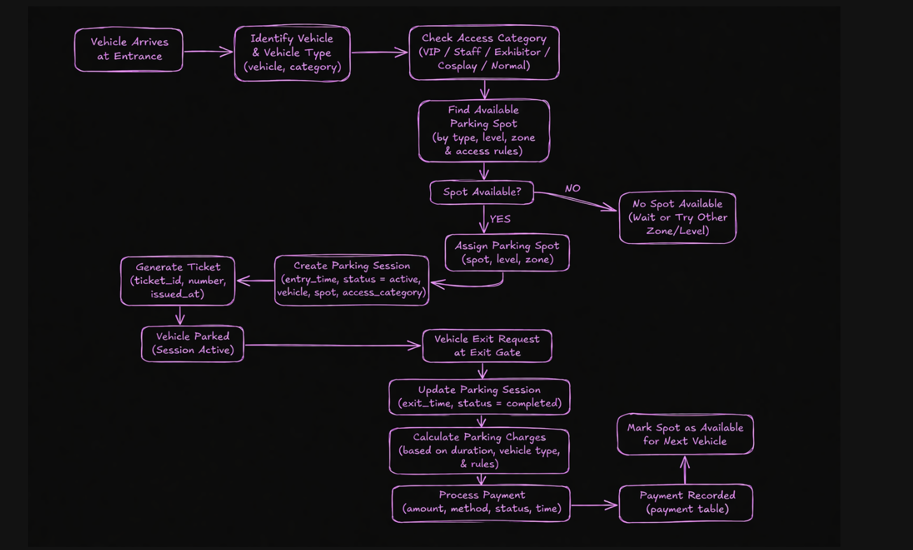
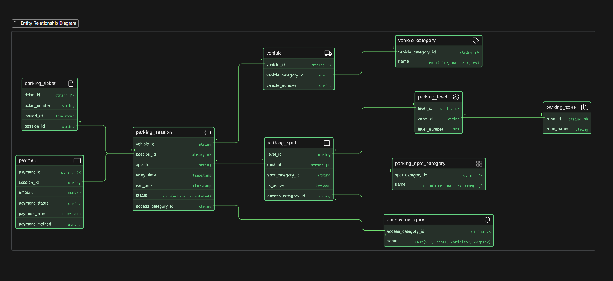

# Comic-Con Parking System (DB Design)

## Problem Statement:

A large convention venue hosts Comic-Con India, where thousands of visitors arrive across multiple days for anime screenings, cosplay competitions, gaming showcases, creator meetups, merchandise zones and panel discussions.

During the event, people arrive using bikes, cars, SUVs, cabs and EV vehicles. The venue has a structured parking facility divided into multiple zones and levels. Some parking areas are reserved for cosplayers with props, exhibitors, creators, VIP guests, staff members and EV charging vehicles.

Whenever a vehicle enters the parking facility, the system generates a parking ticket and assigns a suitable parking spot depending on vehicle type and availability. When the vehicle exits, the system records exit time and calculates the parking fee.

The venue management wants a system that can track:

- vehicles entering the parking facility
- vehicle categories
- parking spot allocation
- reserved parking categories
- entry and exit timestamps
- parking sessions
- payment status
- spot availability across zones and levels

This is a multi-zone event parking system where vehicle types, access categories, sessions, tickets and payments must be modeled properly.

### Thought Process:
- Understand the flow of the parking operations
- Find the main things(Tables)
- Find the things jo table me aa sakta hai 
- make relationships between tables

### Flow 

### ER Diagram:

### Relationships:

- many vehicles - 1 category (1:M)
- many parking spots - 1 zone (1:M)
- many parking sessions - 1 vehicle (1:M)
- many payments - 1 parking session (1:M)

